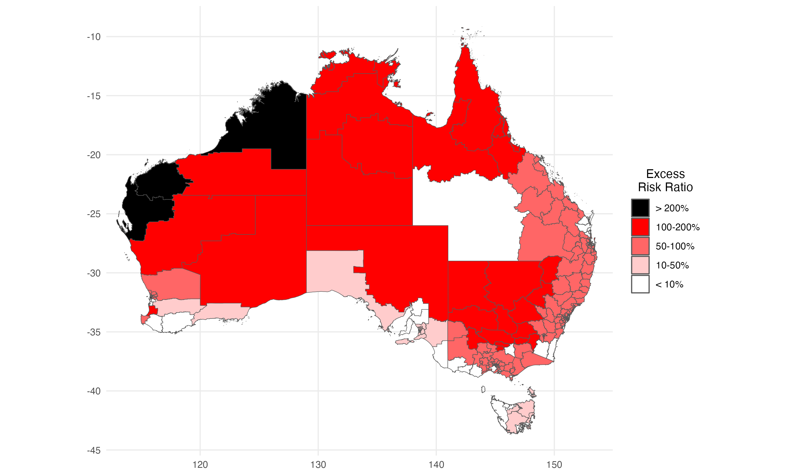

```{r options, echo=FALSE}
knitr::opts_chunk$set(fig.path = "images/", fig.width = 6, fig.height = 4,
                      fig.align = "center")
```

## An Algorithmic Approach for Causal Health Equity: A Look at Race Differentials in ICU Outcomes

In this repository you can find the code necessary to reproduce the results from the paper
"An Algorithmic Approach for Causal Health Equity: A Look at Race Differentials in Intensive Care Unit (ICU) Outcomes".

<p align="center">
  
  <br>
  <em>Figure 1: Indigenous Intensive Care Equity (IICE) Radar.</em>
</p>

---

### Installation Instructions
For installing the required dependencies, use the following code. The expected
installation time is within few minutes. R version 4.3.0 or higher is recommended.
The dependencies are compatible with Linux, MacOS, and Windows distributions.

```{r install}
# remotes package used for installing dependencies from Github
if (!requireNamespace("remotes", quietly = TRUE)) {
  install.packages("remotes")
}

# CRAN packages
cran_pkgs <- c(
  "ggplot2", "ggrepel", "data.table", "grf", "xgboost",
  "matrixStats", "zeallot", "stringr", "magrittr", 
  "officer", "assertthat", "plyr"
)

# install dependencies available on CRAN
for (pkg in cran_pkgs) {
  if (!requireNamespace(pkg, quietly = TRUE)) {
    install.packages(pkg)
  }
}

# Github packages
ghub_pkgs <- c("eth-mds/ricu", "dplecko/faircause")

# install dependencies from Github
for (repo in ghub_pkgs) {
  pkg <- strsplit(repo, "/")[[1]][2]
  if (!requireNamespace(pkg, quietly = TRUE)) {
    remotes::install_github(
      repo, ref = if (pkg == "ricu") "drago-ext" else "HEAD"
    )
  }
}

# check installation of all packages
pkg_inst <- vapply(
  c(cran_pkgs, ghub_pkgs), function(pkg) {
    if (grepl("/", pkg)) pkg <- strsplit(pkg, "/")[[1]][2]
    requireNamespace(pkg, quietly = TRUE)
  }, 
  logical(1L)
)

# confirm package installations 
if (all(pkg_inst)) {
  message("All packages are installed and ready.")
} else {
  message(paste(names(pkg_inst)[!pkg_inst], collapse = ", "), " not installed.",
          " Please try again or install manually.")
}
```

---

### Analysis Demo
A demo analysis can be run immediately after successful installation of the above
dependencies. The runtime of the demo analysis should be under 1 minute.
For reproducing full results, please see information about full data
setup below.

```{r demo-analysis, fig.align='center', message=FALSE, warning=FALSE}
ricu:::init_proj()
set.seed(2024)

# selecting MIMIC-III demo as the data source
src <- "mimic_demo"

# loading the data
dat <- load_data(src, split_elective = TRUE)

# showing sample size information
cat("MIMIC-III (Demo) loaded with", nrow(dat), "samples.")

# information about the Standard Fairness Model
cat("Decomposing TV on", srcwrap(src), "with SFM\n")
c(X, Z, W, Y) %<-% attr(dat, "sfm")
print_sfm(X, Z, W, Y)

# decomposing the TV measure using the faircause package
fcb <- fairness_cookbook(
  data = dat, X = X, Z = Z, W = W, Y = Y, x0 = 0, x1 = 1, 
  method = "debiasing"
)

# extract the fairness measures from the faircause object
res <- summary(fcb)$measures
res <- res[res$measure %in% c("tv", "ctfde", "ctfse", "ctfie"), ]

# change IE, SE signs of easier interpretability
res[res$measure %in% c("ctfse", "ctfie"), ]$value <- 
  - res[res$measure %in% c("ctfse", "ctfie"), ]$value
res$measure <- factor(res$measure, levels = c("ctfse", "ctfie", "ctfde", "tv"))


# specifying the x-axis labels
xlabz <- c(
  tv = "Total Variation", ctfde = "Direct",
  ctfie = "Indirect", ctfse = "Confounded"
)

# plot the decomposition
ggplot(res, aes(x = measure, y = value,
                ymin = value - 1.96 * sd, ymax = value + 1.96 * sd)) +
  geom_bar(position="dodge", stat = "identity", linewidth = 1.2,
           color = "black") +
  theme_minimal() +
  geom_errorbar(
    position = position_dodge(0.9),
    color = "black", width = 0.25
  ) +
  theme(
    legend.position = "inside",
    legend.position.inside = c(0.75, 0.25),
    legend.box.background = element_rect(),
    legend.text = element_text(size = 20),
    axis.text = element_text(size = 16),
    axis.title.x = element_text(size = 18),
    title = element_text(size = 16)
  ) + scale_x_discrete(labels = xlabz) +
  xlab("Causal Fairness Measure") + ylab("Value") +
  scale_y_continuous(labels = scales::percent) +
  ggtitle("MIMIC-III (Demo) TV decomposition")
```

### Using the Shiny App

The data can also be analyzed using the Shiny App located in the `shiny-app` folder.
For starting the app, install `shiny` and simply run:

```{r shiny, eval=FALSE}
shiny::runApp("shiny-app")
```

To save the demo data to a csv file before running the analysis, you can use:
```{r shiny-csv-save, eval=FALSE}
write.csv(load_data("mimic_demo")[, -c("icustay_id", "diag_index")], 
          file = "shiny-app/mimic-iii-demo.csv", row.names = FALSE)
```

---

### Reproducing the results
The code used for reproducing the results of the paper is contained in the `scripts/` folder. 
The script `reproduce.R` can be used to run the analyses. 
In the below tables, we point to the files used to generate the respective figures. Within each specific files, code comments are included that explain the logic of
the analyses step-by-step.

##### Main text:

| Figure   | Code   | 
|:-----------|:------------:|
| [Fig. 2(b)](#): Total variation (TV) decompositions. | `scripts/tv-decompositions.R` |
| [Fig. 3(a-c)](#): Age and socioeconomic status (SES) distributions. | `scripts/confounded-effects.R` |
| [Fig. 3(d-f)](#): Illness severity & chronic health distributions. | `scripts/indirect-effects.R` |
| [Fig. 4](#): Heterogeneity of direct effects. | `scripts/de-E-cond.R` |
| [Fig. 5](#): Baseline risks of ICU admission. | `scripts/admission-risks.R` |
| [Fig. 6](#): Increased admission-improved survival-increased readmission pattern. | `scripts/de-E-cond.R` + `scripts/admission-risks.R` |
| [Fig. 7](#): Indigenous Intensive Care Equity (IICE) Radar. | `scripts/iice-radar.R` |

##### Supplements

| Figure   | Code   | 
|:-----------|:------------:|
| [Fig. A1](#): Patient filtering steps. | `scripts/appendix/study-flowchart.R` |
| [Fig. C2](#): Overlap assumption sensitivity. | `scripts/appendix/overlap.R` |
| [Fig. D3](#): Heterogeneity of indirect effects. | `scripts/appendix/ie-E-cond.R` |
| [Fig. E4](#): Missing data sensitivity. | `scripts/appendix/miss-sensitivity.R` |

---

### Data Loading & Availability
Data loading was performed using the [ricu R-package](https://github.com/eth-mds/ricu). 
Access to the [MIMIC-IV](https://mimic.mit.edu/) dataset is possible through 
[Physionet](https://physionet.org/content/mimiciv/3.1/). After obtaining valid 
credentials and data access, the setup can be done using the `ricu` package.
Access to ANZICS APD dataset is possible by applying to the dataset owners in
[Australian and New Zealand Intensive Care Society](https://www.anzics.org/adult-patient-database-apd/).
We now provide details for setting up the database with `ricu` once access is obtained.


#### Setting up ANZICS APD
For setting up the ANZICS APD database with `ricu`, we provide an installation
script in `scripts/data-init/anzics-init.R`. The following information is necessary:

1. The ANZICS APD data export should be placed in the `anzics` folder within the
`ricu` data directory (the location can be obtained by running `ricu::data_dir()`).
The file name should be `apd-export.csv`.
2. The information about Socioeconomic Indexes for Areas ([SEIFA](https://www.abs.gov.au/statistics/people/people-and-communities/socio-economic-indexes-areas-seifa-australia/2021/Postal%20Area%2C%20Indexes%2C%20SEIFA%202021.xlsx)) 
by postal area (POA) should be placed in `data/abs-data/poa-seifa.xlsx`.
3. The diagnosis information table in `data/d_diagnoses.csv` which is part of this
repository.

After setting up the above three files in the appropriate places, one can run the
`anzics-init.R` script from `scripts/data-init` folder. 
Further comments in the script explain the data setup steps.

#### Setting up data from the Australian Bureau of Statistics

Here we provide a specification for how to obtain all the necessary files from the
[Australian Bureau of Statistics](https://www.abs.gov.au/), used for reproducing 
the analyses on the baseline risks of ICU admission.

1. Shape files for Statistical Areas 1, 3 (download [SA1](https://www.abs.gov.au/statistics/standards/australian-statistical-geography-standard-asgs-edition-3/jul2021-jun2026/access-and-downloads/digital-boundary-files/SA1_2021_AUST_SHP_GDA2020.zip), [SA3](https://www.abs.gov.au/statistics/standards/australian-statistical-geography-standard-asgs-edition-3/jul2021-jun2026/access-and-downloads/digital-boundary-files/SA3_2021_AUST_SHP_GDA2020.zip)).
These files should be placed in the folder `data/abs-data/sa1-shp` and each filename inside should be `sa1-shp`, e.g., `sa1-shp.shp` (and similarly for `sa3-shp`).
2. Socio-Economic Indexes for Areas for SA1 (download [SEIFA SA1](https://www.abs.gov.au/statistics/people/people-and-communities/socio-economic-indexes-areas-seifa-australia/2021/Statistical%20Area%20Level%201%2C%20Indexes%2C%20SEIFA%202021.xlsx)).
This file should be placed in `data/abs-data/sa1-seifa.xlsx`.
3. SEIFA data for postal areas (download [SEIFA POA](https://www.abs.gov.au/statistics/people/people-and-communities/socio-economic-indexes-areas-seifa-australia/2021/Postal%20Area%2C%20Indexes%2C%20SEIFA%202021.xlsx)).
This file should be placed in `data/abs-data/poa-seifa.xlsx`. 
4. Population counts across for Statistical Areas 3. This data needs to be extracted manually from the [ABS TableBuilder Pro](https://www.abs.gov.au/statistics/microdata-tablebuilder/tablebuilder).
Upon obtaining login for TableBuilder Pro, select `2021 Census - counting persons, place of enumeration`.
In `Age and Sex` dropdown menu, choose variable `AGE5P` and assign it to columns.
In `Main Statistical Area Structure` dropdown, choose SA3 level and assign it to rows.
In `Aboriginal and Torres Strait Islander Peoples` dropdown, select `INGP Indigenous Status` and assign it to wafers.
Finally, export the table and place it in `data/abs-data/sa3-counts.csv`.
5. Population counts for the overall country for 2021. Assign `AGE5P` to columns,
`INGP Indigenous Status` to rows, and `Australia` as a wafer. Export the table 
and place it in `data/abs-data/au-counts-2021.csv`.
6. Population counts for the overall country for 2016. 
Select `2016 Census - counting persons, place of enumeration`. assign `AGE5P` to columns,
`INGP Indigenous Status` to rows, and `Australia` as a wafer. Export the table 
and place it in `data/abs-data/au-counts-2016.csv`.