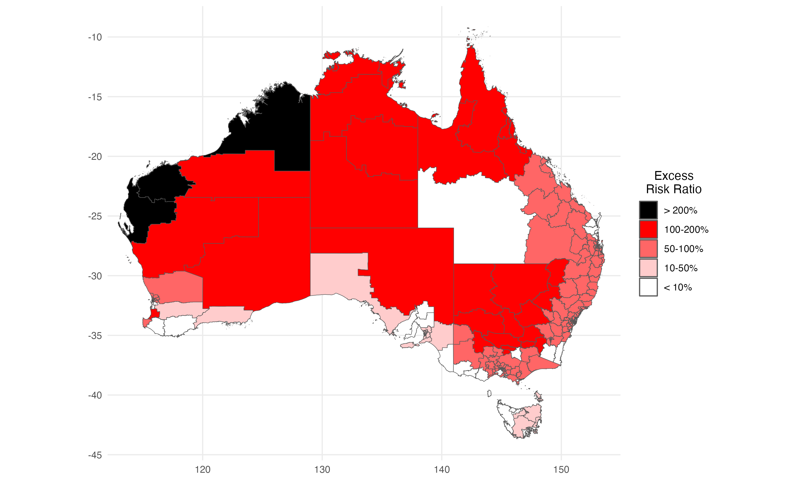

## An Algorithmic Approach for Causal Health Equity: A Look at Race Differentials in ICU Outcomes

In this repository you can find the code necessary to reproduce the results from the paper
"An Algorithmic Approach for Causal Health Equity: A Look at Race Differentials in Intensive Care Unit (ICU) Outcomes".

  
  
Figure 1: Indigenous Intensive Care Equity (IICE) Radar.

### Reproducing the results
The code used for reproducing the results of the paper is contained in the `scripts/` folder. 
The script `reproduce.R` can be used to run the analyses. 
In the below tables, we point to the files used to generate the respective figures. 
Prior to running the code, install any necessary dependencies appearing in `r/zzz-deps.R`.

##### Main text:

| Figure   | Code   | 
|:-----------|:------------:|
| [Fig. 2(b)](#): Total variation (TV) decompositions. | `scripts/tv-decompositions.R` |
| [Fig. 3(a-c)](#): Age and socioeconomic status (SES) distributions. | `scripts/confounded-effects.R` |
| [Fig. 3(d-f)](#): Illness severity & chronic health distributions. | `scripts/indirect-effects.R` |
| [Fig. 4](#): Heterogeneity of direct effects. | `scripts/de-E-cond.R` |
| [Fig. 5](#): Baseline risks of ICU admission. | `scripts/admission-risks.R` |
| [Fig. 6](#): Increased admission-improved survival-increased readmission pattern. | `scripts/de-E-cond.R` + `scripts/admission-risks.R` |
| [Fig. 7](#): Indigenous Intensive Care Equity (IICE) Radar. | `scripts/iice-radar.R` |

##### Supplements

| Figure   | Code   | 
|:-----------|:------------:|
| [Fig. A1](#): Patient filtering steps. | `scripts/appendix/study-flowchart.R` |
| [Fig. C2](#): Overlap assumption sensitivity. | `scripts/appendix/overlap.R` |
| [Fig. D3](#): Heterogeneity of indirect effects. | `scripts/appendix/ie-E-cond.R` |
| [Fig. E4](#): Missing data sensitivity. | `scripts/appendix/miss-sensitivity.R` |

##### Data Loading & Availability
Data loading was performed using the `ricu` R-package. 
Access to the MIMIC-IV dataset is possible through Physionet. 
Access to ANZICS APD dataset is possible by applying to the dataset owners in
Australian and New Zealand Intensive Care Society.